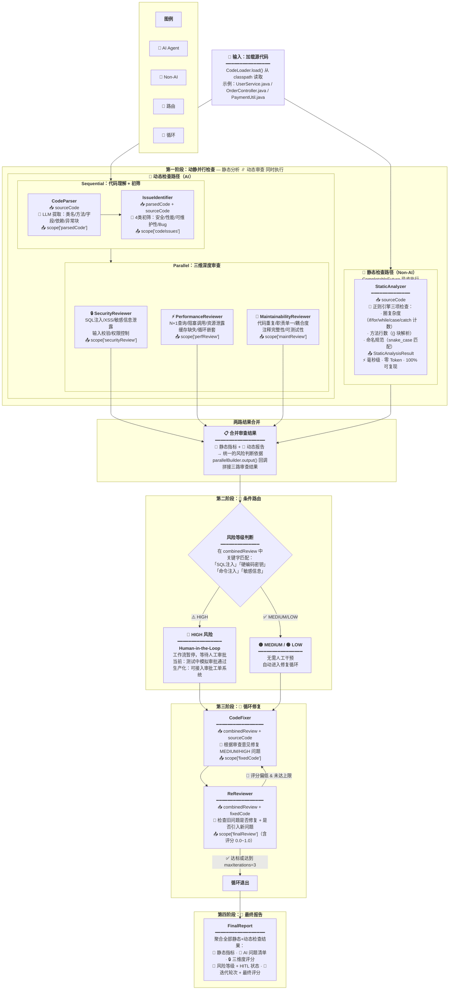

# 智能代码审查与优化系统 — LangChain4j Agentic 工作流编排实战

基于 LangChain4j Agentic 框架的代码审查系统，采用 **静态检查 + 动态检查** 动静结合的架构设计，
覆盖 **6 种工作流模式**在真实场景中的有机组合。

### 核心架构：静态检查 ∥ 动态检查

```
                    源代码 (sourceCode)
                          │
        ┌─────────────────┼─────────────────┐
        ▼                                    ▼
  📏 静态检查（非AI）                  🤖 动态检查（AI）
  StaticAnalyzer                      CodeParser → IssueIdentifier
  · 圈复杂度 / 方法行数 / 命名           · 代码解析 → 问题初筛
  · 纯 Java 正则，零 LLM               · 4 类问题（安全/性能/可维护性/Bug）
  · 毫秒级，100% 可复现                       │
        │                            3 × Reviewer（并行深度审查）
        │                            Security / Performance / Maintainability
        │                                    │
  StaticAnalysisResult               combinedReview
        │                                    │
        └─────────────────┬──────────────────┘
                          ▼
                  🚦 风险路由（条件决策）
                  HIGH → HITL 人工审批
                  MEDIUM/LOW → 自动修复
                          │
                          ▼
                  🔨 循环修复（CodeFixer ⇄ ReReviewer）
                  maxIterations = 3
                          │
                          ▼
                  📝 最终报告（FinalReport）
```

## 业务流程图（详细版）



### 各 Agent 职责速查

| 路径 | Agent | 类型 | 核心职责 | 关键输入 | 关键输出 |
|:---:|------|:---:|------|------|------|
| 📏 静态 | **StaticAnalyzer** | 非AI | 正则引擎：圈复杂度(>10告警)、方法行数(>50告警)、命名规范 | `sourceCode` | `StaticAnalysisResult` |
| 🤖 动态 | **CodeParser** | AI | 提取代码结构化信息（类/方法/字段/依赖/异常） | `sourceCode` | `parsedCode` |
| 🤖 动态 | **IssueIdentifier** | AI | 基于解析结果识别 4 类潜在问题，给出严重度和修复建议 | `parsedCode` + `sourceCode` | `codeIssues` |
| 🤖 动态 | **SecurityReviewer** | AI | SQL注入/XSS/敏感信息泄露/输入校验/权限控制 5 维安全审查 | `codeIssues` + `sourceCode` | `securityReview` |
| 🤖 动态 | **PerformanceReviewer** | AI | N+1查询/阻塞调用/资源泄露/缓存缺失/循环嵌套 性能分析 | `codeIssues` + `sourceCode` | `perfReview` |
| 🤖 动态 | **MaintainabilityReviewer** | AI | 代码重复/职责单一/耦合度/注释完整性/可测试性 评估 | `codeIssues` + `sourceCode` | `maintReview` |
| 🚦 决策 | **条件路由** | 逻辑 | 关键字匹配判断风险等级，HIGH→人工审批 / LOW→自动修复 | `combinedReview` | 决策分支 |
| 🔨 修复 | **CodeFixer** | AI | 根据审查意见修复 MEDIUM/HIGH 问题，输出修复后完整代码 | `combinedReview` + `sourceCode` | `fixedCode` |
| 🔨 修复 | **ReReviewer** | AI | 重新审查修复结果，验证旧问题是否修复 + 是否引入新问题 | `combinedReview` + `fixedCode` | `finalReview` |
| 📝 输出 | **FinalReport** | — | 聚合静态+动态全部阶段结果，输出一站式质量全景报告 | 所有 scope 数据 | 控制台报告 |

## 架构设计详解：为什么是"动静结合"？

### 核心问题：所有代码检查都交给 AI 做吗？

不是。代码检查可以分两类：

| | 📏 静态检查 | 🤖 动态检查 |
|------|-----------|-----------|
| **查什么** | 可量化的指标 | 需要语义理解的问题 |
| **例子** | 圈复杂度=15、最长方法=67行、变量名 `user_name` 应改为 `userName` | SQL 注入风险、N+1 查询、耦合度过高 |
| **怎么查** | 正则 + 计数，规则明确 | LLM 推理，需要理解上下文 |
| **谁来做** | StaticAnalyzer（1 个 Non-AI Agent） | CodeParser → IssueIdentifier → 3×Reviewer（5 个 AI Agent） |
| **成本** | 零 Token，毫秒级响应 | 消耗 Token，单 Agent 3-8 秒 |
| **确定性** | 100% 可复现 | 受模型温度参数影响 |

> 💡 **关键认知**：不是所有检查都需要 AI。规则明确的交给代码（快、准、免费），语义模糊的交给 LLM（灵活、深度但消耗 Token）。两者互补，才是工程化的正确姿势。

### 为什么静态和动态要并行执行？

因为两者**只依赖源代码，互不依赖**：

```
静态路径：sourceCode → StaticAnalyzer → StaticAnalysisResult   (约 0.01 秒)
动态路径：sourceCode → CodeParser → IssueIdentifier → 3×Reviewer → combinedReview  (约 5-15 秒)

并行执行总耗时 ≈ max(0.01, 15) ≈ 15 秒
串行执行总耗时 = 0.01 + 15 = 15.01 秒  ← 白白等 0.01 秒
```

虽然 StaticAnalyzer 本身很快，但这个架构模式适用于"静态检查变重"的场景（如接入 SonarQube、PMD 等外部工具时，耗时可能数秒甚至数十秒）。

### 动态检查内部：为什么先初筛再专科？

CodeParser → IssueIdentifier 这条 Sequential 链路做的是**全科初筛**：

1. **CodeParser**：把原始代码"翻译"为结构化描述（类名、方法签名、字段列表、依赖关系、异常处理块）。这步不找问题，只做理解。
2. **IssueIdentifier**：基于结构化理解，一次性扫出 Security / Performance / Maintainability / Bug 四大类的**所有疑似问题**，给出严重度和修复建议。

三个 Reviewer 拿到这份"疑似问题清单"后，各自做**专科深度分析**：
- 初筛清单作为**参考上下文**（不是最终结论），帮 Reviewer 快速定位
- Reviewer 可能发现初筛漏掉的问题（边界情况、组合问题）
- Reviewer 也可能判定某个初筛问题是误报（交叉验证，减少幻觉）
- 三个 Reviewer **并行执行**，总耗时 ≈ max(单个)，而非 sum

### 静态与动态的关系：互补而非冗余

StaticAnalyzer 查的（圈复杂度、方法行数、命名规范），IssueIdentifier 也会提——这不是重复吗？

**不重复，是互补：**

| 维度 | StaticAnalyzer 做的 | IssueIdentifier 做的 |
|------|-------------------|---------------------|
| 圈复杂度 | 精确计数：`if/for/while/case/catch` 共 3 个 | 语义判断：这 3 个分支是否合理？逻辑是否过于复杂？ |
| 方法行数 | 精确测量：最长方法 14 行 | 语义判断：这个方法职责单一吗？需要拆分吗？ |
| 命名规范 | 正则匹配：发现 `user_name` 不符合 camelCase | 语义判断：`user_name` 这个变量名是否表达了正确的含义？ |

> StaticAnalyzer 给出**客观事实**（"是什么"），IssueIdentifier 和 Reviewer 给出**主观判断**（"好不好"）。

## 工作流模式覆盖

| 模式 | 对应组件 | 作用 |
|------|---------|------|
| **Sequential** | CodeParser → IssueIdentifier | 代码解析 → 问题初筛（动态检查内的依赖链路） |
| **Non-AI Agent** | StaticAnalyzer | 圈复杂度/行数/命名规范（静态检查，纯 Java 正则） |
| **Parallel（双层）** | 外层：静态 ∥ 动态；内层：3 × Reviewer | 动静并行 + 三维度并发审查 |
| **Conditional** | 风险路由 | 高风险→人工确认 / 中低风险→自动修复 |
| **Loop** | CodeFixer → ReReviewer | 修复→重审直到质量达标（max 3 轮） |
| **Human-in-the-Loop** | 模拟人工审批 | 高风险问题暂停等待人工确认 |

## 快速启动

```bash
# 配置 API Key
export DEEPSEEK_API_KEY=your_deepseek_api_key

# 运行集成测试
cd langchain4j-spring-boot-14-code-review-agentic
mvn test -Dtest=CodeReviewWorkflowTest#testFullReviewWorkflow
```

## 示例代码

`src/test/resources/sample-code/` 包含 3 个故意植入问题的 Java 文件：

| 文件 | 植入问题 |
|------|---------|
| `UserService.java` | SQL 注入、N+1 查询、异常吞掉、缺少输入校验 |
| `OrderController.java` | 异常堆栈泄露、Thread.sleep 阻塞、空指针 |
| `PaymentUtil.java` | 硬编码密钥、空指针、缺少事务注解 |

## 项目结构

```
com.langchain4j/
├── Application.java                 # Spring Boot 启动
├── agent/                           # 8 个 AI Agent 接口
│   ├── CodeParser.java              # Seq-1: 解析代码结构
│   ├── IssueIdentifier.java         # Seq-2: 识别潜在问题
│   ├── SecurityReviewer.java        # Par-1: 安全性审查
│   ├── PerformanceReviewer.java     # Par-2: 性能审查
│   ├── MaintainabilityReviewer.java # Par-3: 可维护性审查
│   ├── CodeFixer.java               # Loop-1: 生成修复代码
│   └── ReReviewer.java              # Loop-2: 重新审查
├── nonai/
│   └── StaticAnalyzer.java          # Non-AI Agent: 静态分析
├── domain/                          # 8 个领域模型类
├── util/
│   └── CodeLoader.java              # 加载示例代码
└── config/
    └── AgenticConfig.java           # Agent Bean 配置
```

## 与 Cookbook 其他示例的关系

| 示例 | 本项目如何进阶 |
|------|-------------|
| `11-agentic`（独立模式演示） | 6 种模式在**一个连贯工作流**中组合 |
| `13-customerService`（Agent + Tool） | 展示复杂**工作流编排**而非 Agent 设计 |

## 进阶方向

- **真实 Human-in-the-Loop**：接入审批服务，实现真正的人工审批流程
- **多文件审查**：扩展为同时审查多个文件并交叉引用
- **结构化输出**：Agent 返回 POJO 而非 String，提升类型安全
- **持久化审查历史**：将审查结果存入数据库，追踪代码质量变化趋势
